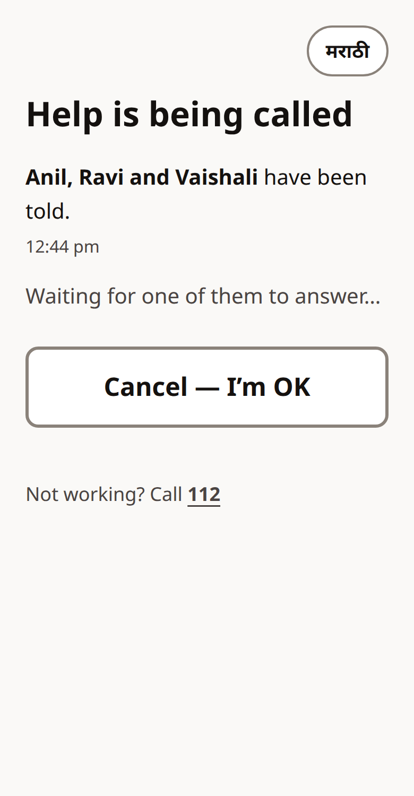
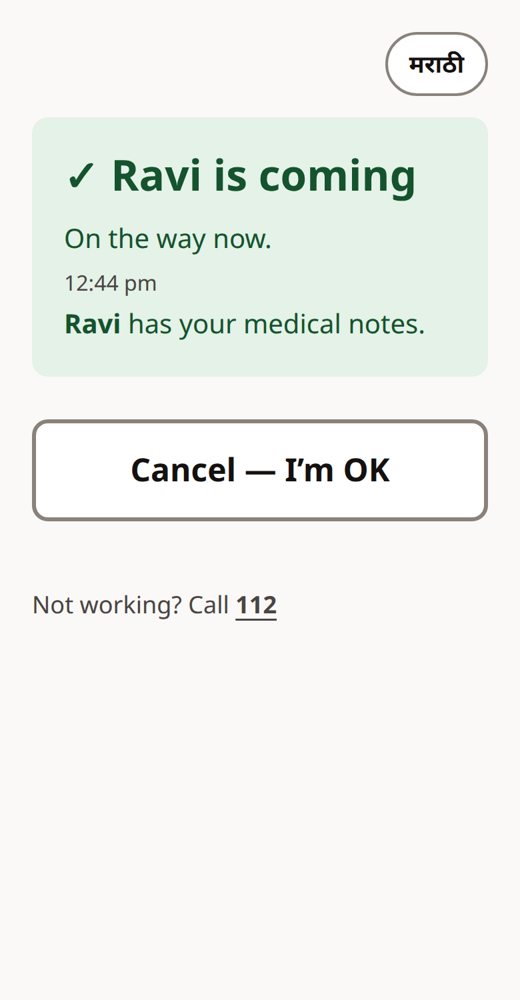
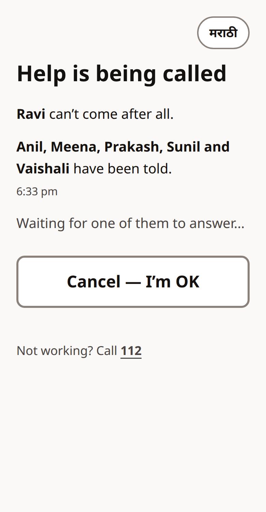
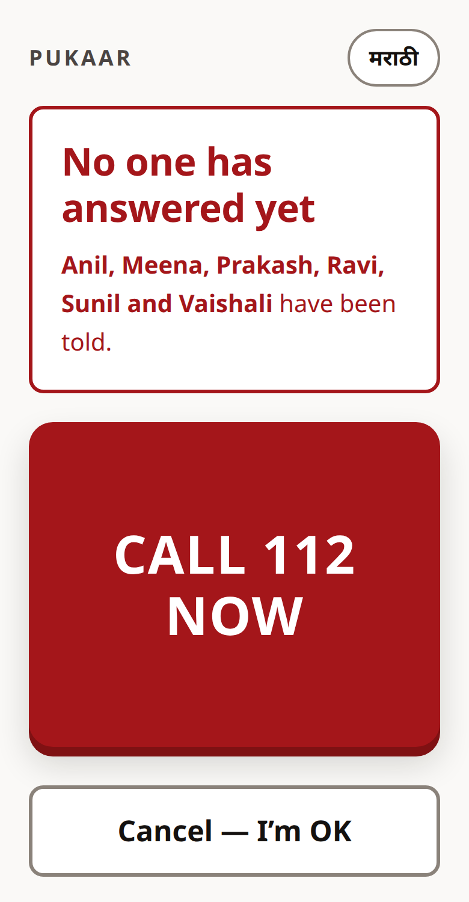
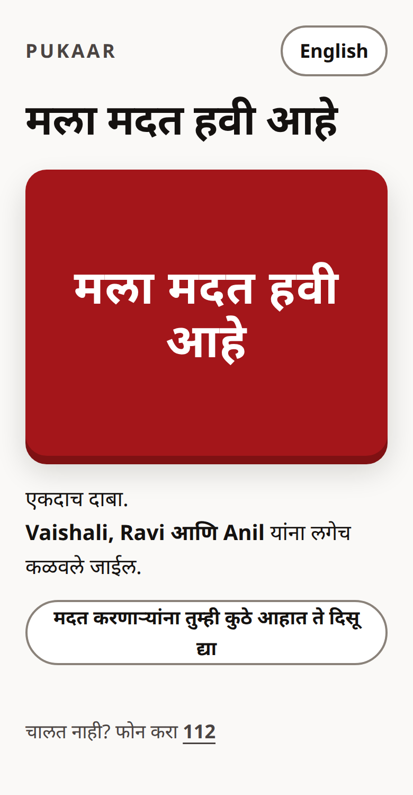
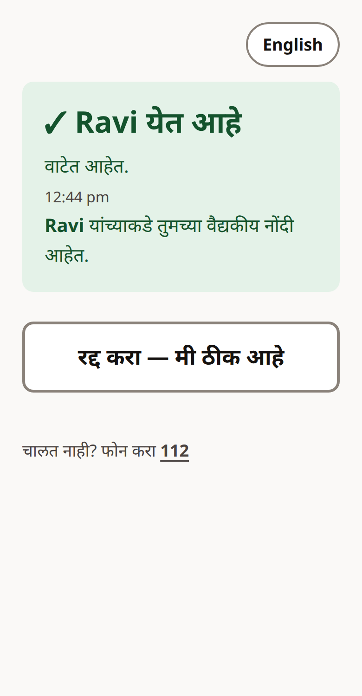
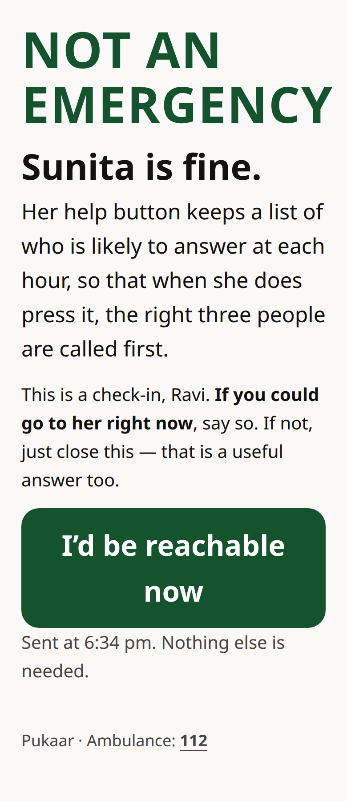
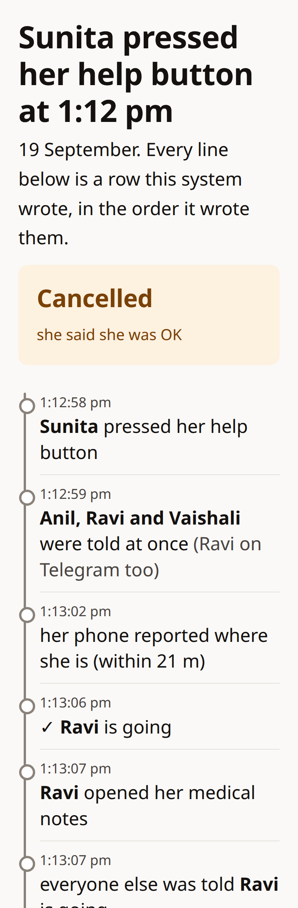
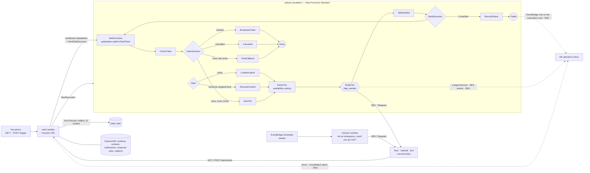

# Pukaar

**One press pages the three people most likely to answer, at the same time. The first to say "I'm going" wins. Everyone else is told who is coming. If nobody answers within a minute, the circle widens.** An older person living alone should not have to work through a phone list while she is on the floor.

<table>
<tr>
<td width="33%" align="center"></td>
<td width="33%" align="center"></td>
<td width="33%" align="center"></td>
</tr>
<tr>
<td align="center"><sub><b>Her screen.</b> One button, and who will be told is already on it.</sub></td>
<td align="center"><sub><b>After the press.</b> Who has been told, the time, and one thing to do: <i>Cancel — I'm OK</i>.</sub></td>
<td align="center"><sub><b>When someone answers.</b> <i>Ravi is coming</i>, by name, the moment the row changes. The phone says it aloud.</sub></td>
</tr>
</table>

*Her screen before, during and after a press. One real alert on the live stack, 19 Sep 13:12. The helpers' pages and the timeline are under [What happens when she presses](#what-happens-when-she-presses).*

- **The design decision:** the escalation is a Step Functions state machine, not a loop in a server. A parallel `Map` pages the whole circle at once. A conditional DynamoDB write decides the race between two answerers. The machine waits for a task token, so a claim or a cancel wakes it in about a second instead of at the next timer.
- **Cost per incident:** about **$0.0014 (₹0.12)** when the son answers from the first circle, **$0.0039 (₹0.35)** when nobody answers and it widens to everyone. Idle cost is a fraction of a cent per person per month, plus one $1/month KMS key. A thousand people with one incident each: about $6/month, or $10 with the weekly check-in. Numbers from [`cost.py`](cost.py), list prices, counted off real executions.
- **Live:** https://jseoe3z3uew46fyd6zbceyry6u0ebdgt.lambda-url.ap-south-1.on.aws/ (pressing it pages six test mailboxes and one Telegram, all mine).
- **Demo video:** *added at submission.*
- **Proof it works:** [`verify.sh`](verify.sh) runs twenty-one checks against the live stack. Each one asserts on rows and execution history, not on status codes. Last run 21/21. Unit tests and `terraform validate` run on every push: [](https://github.com/aryangorde6/pukaar/actions/workflows/ci.yml). Every break during the build is in [`LEARNING-LOG.md`](LEARNING-LOG.md) with the commit that fixed it.

Built solo during Bharat Builds Tour, First Commit, 17–20 September 2026, in ap-south-1.

---

## The problem

An older person living alone falls, or feels something is wrong, and has a phone. She calls one number. If it does not answer she calls the next, and each try costs a minute she may not have. The son is in a meeting. The neighbour across the hall is home but was never called. Nobody knows that nobody is coming.

India had about 138 million people aged sixty and over in 2021 and will have about 194 million by 2031. In the last national household survey, 4.2 % of them lived alone and another 14.1 % with only a spouse. That is roughly six million people alone, and nineteen million more whose only company is usually the same age ([NSO, *Elderly in India 2021*](https://mospi.gov.in/sites/default/files/publication_reports/Elderly%20in%20India%202021.pdf), Tables 3.1 and 5.9(c); NSS 75th round, 2017–18).

I talked to ten neighbours in my building, in their late sixties to eighties. Most of them described the same thing. One woman said that the last time she needed someone urgently she called three or four people before one answered; she does not remember the exact number. Her son first, then relatives nearby. A nephew about two kilometres away came in fifteen to twenty minutes, which she called lucky. Her nearest neighbours were out at work on weekdays. Once she called the building's watchman, and he helped. This is what she told me, not a study, and she agreed to be mentioned without her name.

Pukaar replaces the sequence with a fan-out. One press pages the three people most likely to answer right now, in parallel. The first to say "I'm going" wins, everyone else is told who is coming, and if nobody answers within a minute the circle widens. She can call it off with one more press, even after someone is on their way.

What that changes, measured on a real press (19 Sep, execution `cfe0c80f32e4`, times from its own history): the third of the three pages was with SES 2.5 s after the machine started (13:12:58.091 to 13:13:00.617). When Ravi tapped *I'm going now*, everyone else had been told who was coming 2.1 s later (13:13:06.932 to 13:13:08.989). Her screen asks the row every three seconds, so *Ravi is coming* is on it within about three seconds of his tap. Her three or four calls become three pages at once, and the moment one person says yes, she and the others know within seconds.

## What happens when she presses

1. **Her screen** (`GET /`) is one button. It already says who will be told, *"Vaishali, Ravi and Anil will be told straight away"*, read from the same ranking the machine will use. It installs on her home screen as *Pukaar* (`/manifest.webmanifest`, two PNG icons served by the same function), so the button is an icon, not an address to type. Open it with `?lang=mr` once at setup and every word on her screen is Marathi (*मला मदत हवी आहे*). The phone remembers, and one pill on the page switches between English and her language. Ten languages besides English: Marathi and Hindi were read by someone who speaks them; Gujarati, Tamil, Telugu, Kannada, Bengali, Malayalam, Punjabi and Odia are drafts checked by machine translation only and still need a reader, which is one reason English stays one tap away. A language is twenty-six strings in [`web.py`](lambdas/web.py). Only her page is translated. The people paged are younger, and their pages and emails stay English.
2. **The press** (`POST /trigger`) starts one execution of `pukaar-escalation`, named after the incident, so a retried request cannot start the same incident twice. The button disables itself on press. A second press while an alert is running (a double tap, a reload, the app reopened) joins that alert instead of starting another, and her page reopened during one shows it.
3. **The circle is paged at once.** `SelectTier` ranks everyone on her list and takes the top three not yet reached. A parallel `Map` sends each of them an email with a one-time link, and the same link on Telegram, as a button, to anyone who has started her bot (the son, in the demo). In the execution history the three sends carry the same timestamp (`13:22:59.690` on the first live run).
4. **The machine waits for a task token**, parked on the incident row. If nobody answers in `wait_s` seconds it wakes by timeout, checks the row, and widens to the next three. At the last circle everyone is paged, then a final *no one has reached her* email goes to the whole list.
5. **Someone taps "I'm going now."** One conditional `UpdateItem` (`status IN (OPEN, FALLBACK)`) decides the race. The loser's page says *"Ravi is already on the way"*, read from the row after the write. The winning write returns the parked token, `SendTaskSuccess` wakes the machine, and everyone reached is told who is coming. Measured: cancel to *Cancelled* in 1.0 s; claim to everyone told in 2.8 s, emails included.
6. **The winner's page opens her sealed medical notes** (blood group, medication, allergy, a daughter's number), decrypted from a KMS customer-managed key for that one person, and her screen says *"Ravi has your medical notes."* If he can't go after all, one more tap on that page says so (`POST /release/<token>`, his link alone, within half an hour of the claim). The alert reopens with the step-back on its row, everyone else contacted is told with a fresh link, the machine picks the alert up again at the next circle (`ResumeIncident`, not `CreateIncident`, with the timers it began with), and her screen says *"Ravi can't come after all"* and who is told now (check 17).
7. **Her screen updates by itself** (`GET /status`, polled every 3 s): *✓ Ravi is coming*. Each state after the press is also read aloud in her language by the phone's own voice, so she does not have to read it; it stays silent where the phone has no voice for that language. A Cancel button stays on the screen. As the circle widens the new names join the list, and if the whole list has been told and no one has answered, the screen says *No one has answered yet* and the button becomes *Call 112* (check 4).
8. **Where she is.** She may not be at home. Her page asks once, at setup, whether helpers may see where she is (a small line under the button, gone once answered either way). After that, every press sends her phone's position, after the page has already been paged, so the alert never waits on GPS. The page a responder opens says *Her phone, at 2:41 pm: within 20 m of this spot*, with a maps link, beside her home address. The position is written only on a live alert and only with her page's key (`POST /location`, check 16).
9. **Afterwards, what happened, in order** (`GET /incident/<id>`, linked from every settled responder page and from the two messages that ask nothing of anyone, *Ravi is going* and *False alarm*): the press, each circle's sends with one timestamp, who answered, who went, who opened her notes, the ending. Every line is a row this system wrote. The page refreshes itself while the alert is open. For her family, and for anyone who was paged and wants to know.

<table>
<tr>
<td width="33%" align="center"></td>
<td width="33%" align="center"></td>
<td width="33%" align="center"></td>
</tr>
<tr>
<td align="center"><sub><b>What a contact opens.</b> Her name, her address, where her phone is, <i>I'm going now</i>.</sub></td>
<td align="center"><sub><b>After the tap.</b> <i>You're going</i>; her sealed notes, opened for him alone; <i>I can't go after all</i>.</sub></td>
<td align="center"><sub><b>The other two.</b> <i>Ravi is already on the way</i>, by name, from the row.</sub></td>
</tr>
<tr>
<td width="33%" align="center"></td>
<td width="33%" align="center"></td>
<td width="33%" align="center"></td>
</tr>
<tr>
<td align="center"><sub><b>Her screen when he steps back.</b> Who is told now.</sub></td>
<td align="center"><sub><b>Everyone told, nobody answered.</b> The button becomes <i>Call 112 now</i>.</sub></td>
<td align="center"><sub><b>After she cancels.</b> What a contact sees: <i>Sunita cancelled this alert</i>.</sub></td>
</tr>
<tr>
<td width="33%" align="center"></td>
<td width="33%" align="center"></td>
<td width="33%" align="center"></td>
</tr>
<tr>
<td align="center"><sub><b>The same screen in Marathi.</b> One pill; English a tap away.</sub></td>
<td align="center"><sub><b>The same moment in Marathi.</b> Every state, in her language, read aloud.</sub></td>
<td align="center"><sub><b>The weekly check-in.</b> <i>Not an emergency</i>; one tap teaches the ranking who answers.</sub></td>
</tr>
</table>
<p align="center">
  <br>
  <sub><b>One alert, in order.</b> Every line is a row this system wrote.</sub>
</p>

*All thirteen screens in this README (the three at the top and these ten) are from real alerts on the live stack, 19 Sep 13:04–13:14: two presses, one claimed, released and cancelled, one nobody answered. Taken the way she and they would open the pages.*

### Design — the rules the screens follow

1. **One button, at least 240 px tall (a third of a phone screen), its words 44 px capitals.** Her thumb finds it without aiming. It has an edge, so it looks like a thing that can be pressed. On the press it goes down 8 px, the phone buzzes once (200 ms, where it can), and the words change to *Calling for help…*, all before the network answers. The only other controls she ever sees are Cancel, the language pill, 112 and, once, the location question.
2. **20 px body text, 40 px headings, line height 1.6**, set for eyes in their seventies. The timeline's rows are 24 px. Nothing on any page is smaller than 16 px.
3. **Every colour pair passes 7:1** (WCAG AAA, not AA's 4.5). The lowest is 7.3:1, the caution text on its card; white on the red button is 7.8:1. Red means emergency, green means someone is coming, amber means it was called off, on every page.
4. **Every state says who.** *Vaishali, Ravi and Anil will be told* before the press. *Ravi is coming* after it. *Ravi can't come after all. Meena, Prakash and Sunil have been told.* Never "your contacts", never a count alone.
5. **First person, in the words the person would say.** *I need help. I'm going now. I can't go after all. Cancel — I'm OK. I'd be reachable now.*
6. **Nothing to learn.** No icons except a tick and a warning sign. No menus, no settings, no sign-in. The one question her page asks, whether helpers may see where she is, is asked once and the answer sticks.
7. **Her language, and her phone's voice.** The pill switches between English and hers and the phone remembers. Every state after the press is read aloud where the phone has a voice for her language.
8. **Targets: 64 px for every button, 96 px for *I'm going now*, 48 px for the pill and every 112 link.** A 4 px focus ring for keyboard users. Header, main and footer landmarks on every page. The timeline adds new lines in place while the alert is open instead of reloading, so a screen reader is not sent back to the top every five seconds. axe-core 4.10.2 with every rule set it has, best-practice included: no violations on her page in all six states, the alert, *You're going*, *already on the way*, *cancelled*, the check-in, the leave page, the timeline and the 404 (19 Sep; her page's six states and the timeline run again after the last change at 13:15, still none).
9. **112 at the foot of every page.** The button does not replace the ambulance, and the page says so.
10. **One column, 720 px at most, light only.** The same page on a phone, a laptop and a shared screen, and the same at three in the morning.
11. **Motion only where it means something, and none if the phone asks for none.** A red dot pulses beside *Waiting for one of them to answer* so she knows the page is alive. A new state rises in over 0.3 s. The button goes down in 60 ms. A helper's *I'm going now* becomes *Sending…* the moment it is tapped, so a slow network does not invite a second tap. `prefers-reduced-motion` turns the first three off. Nothing spins or loops for decoration.

Measured (19 Sep, after the last change to the pages): Lighthouse 12.8, mobile, on her page and on the timeline page: performance 100, accessibility 100, best practices 100 on each. SEO is 50 on purpose (`noindex`, no description; none of these pages is for search). The page is 40 KB with eleven languages, styles and script, and is served gzipped at 11 KB to any browser that accepts it. She may be opening it on one bar of signal.

### Correctness properties, stated

| Property | How |
| --- | --- |
| A circle is paged in the same instant, not in sequence | `NotifyTier` is a `Map`, not a chain of tasks |
| Two people answering at once produce exactly one winner, and the loser learns who | one conditional write on the incident row; the page renders from the row after the write, not from the request |
| Re-running a send never pages twice | the notification row is written first with `attribute_not_exists`; a retry that finds it delivered sends nothing |
| A second press during an alert does not start a second alert | `POST /trigger` returns the alert already running for her (open, widened, or claimed within the last half hour) instead of starting another; her page, reopened, shows that alert (check 15) |
| A link prefetched by a mail scanner claims nothing | **GET never writes.** Claim links render on GET and claim on POST; the button is the claim |
| The rails are live, not declared | point-in-time recovery and deletion protection on all five tables, the hour's cap in the machine's definition, the alarm's action and the bounce destination both the operator's topic; a page to the bounce simulator is counted and published, and so is the alarm (check 20) |
| A circle that reached nobody fails loudly | one bad address is contained to its iteration; a whole circle with zero deliveries goes to `RecordFailure`, the execution fails, a metric fires, and the operator is emailed through an EventBridge rule on the execution's end and an SNS topic (check 19) |
| A claim or a cancel is acted on now, not at the tier boundary | `WaitForClaim` is `dynamodb:updateItem.waitForTaskToken`; the same write that wins the race returns the token |
| She can cancel at any point, including after someone claimed | after a claim the machine has finished, so the web function asks the broadcast function for the false alarm directly |
| Her screen never says less than the row knows, nor more | `/status` returns who has been told so far on every open alert; her page adds the names as the circle widens, and when the row says `FALLBACK` (everyone told, nobody answered) her screen says so and offers 112 with one tap (check 4); reopened mid-alert, it starts from the delivered rows, not from who a press now would page (check 15) |
| Only her page can call off an alert or say where she is | `/cancel` and `/location` require a key that is rendered into her page and nowhere else (a Terraform `random_password`, in the web function's environment); a responder who knows the incident id from a timeline link gets 403 and the row is untouched (checks 6 and 16) |
| The one who claimed can step back, and nobody is left believing help is coming | `POST /release` is conditional on `status = CLAIMED AND claimed_by = me AND claimed_at` recent; it reopens the row, starts a second execution that resumes at the circle reached, and tells everyone contacted, with a fresh link, before the next circle is paged (check 17) |
| The medical notes are ciphertext at rest and open for one person | KMS CMK, `EncryptionContext={subject_id}`, decrypt permitted to the web role only and only with a context; every opening logged |
| A check-in link can never claim an incident | a check-in row has no incident; `/claim` answers 404 to it, and `/checkin` counts an answer once, within ten minutes of the send, never later (check 13) |
| Someone who leaves her list is never paged, asked or named again | `left_at` on the contact row; `ranking.her_list()` is the one reading of the list that the machine, the broadcasts, the check-in and her screen share (check 18) |

## Architecture



- **Compute:** eight Python 3.13 Lambdas on arm64, 128 MB, one zip. Six run inside the machine and the weekly check-in runs from an EventBridge Scheduler cron, all under role `pukaar-lambda` (DynamoDB, SES, one metric namespace, no KMS). `web` runs under `pukaar-web` (DynamoDB, start/wake the machine, invoke `broadcast`, `kms:Decrypt`, no SES).
- **Data:** five on-demand DynamoDB tables. `notifications` stores only the SHA-256 of the link token (GSI `token_hash-index`); the plaintext exists in the email alone. `subjects.record` is a Binary ciphertext.
- **Edge:** one Lambda Function URL, eleven routes, no API Gateway, no login (the button is hers; the links are one-time, per incident, per person). Three things can reach an alert and each can do one kind of thing. Her page carries a key nothing else does, and only a request with it can cancel or place her. A responder's link claims, steps back or leaves. A timeline id reads.
- **Channels:** email through SES, always; Telegram through the Bot API for a contact row that carries a chat id. Same message, same link, so a person counts as reached if either channel took it. The bot token is a sensitive Terraform variable in `terraform.tfvars` (gitignored), passed only to the paging functions. The chat ids come from the same file through `seed.sh`, never from the repo.
- **When it fails:** every spine state catches into `RecordFailure` (row marked `FAILED` with the cause, metric `Pukaar/EscalationFailed`), the execution ends in `Fail`, and an EventBridge rule on that ending publishes to an SNS topic the operator's address is subscribed to (`operator_email` in `terraform.tfvars`). Transient Lambda faults retry three times with backoff; an SES throttle retries four. One person unreachable is contained to their branch of the `Map`. A circle in which nobody was reached is the failure above. Two failures the machine cannot see reach the same topic: her button's own Lambda returning errors (a CloudWatch alarm on `pukaar-web`, five-minute window) and a page that bounces or is marked spam (an SES configuration set, the sending identity's default, with its events on SNS). No execution can outlive an hour (`TimeoutSeconds` on the machine; a real alert ends in minutes), and a timed-out one is one of the endings the rule mails about. Check 20 does both: one page to SES's bounce simulator and the alarm forced once, and reads the two messages off the topic.
- **Infra:** Terraform, AWS provider 6.x, log retention 7 days, everything in [`main.tf`](main.tf).

## Availability ranking — who is in the first circle

The circle is a set, not an order. Inside a parallel `Map` there is no order, so the only thing the ranking decides is who is paged at all in the first minute. [`lambdas/ranking.py`](lambdas/ranking.py):

```
score = 0.6 · answers + 0.2 · fast + 0.2 · near

answers  share of pages answered, smoothed by a prior worth two pages
         (one answered if usually home during the day, half if not);
         pages in the current hour bucket (e.g. 14#weekday) count twice
fast     1 / (1 + mean answer time in minutes); 0.5 unknown; 0 if paged and never answered
near     1 / (1 + metres / 100)
```

A known answerer beats an unknown, an unknown beats a known non-answerer, and distance only separates people the history cannot. Every page (`notify`) adds to `pages_sent` for that person and hour. Every tap on a link (`web`) adds one response and its latency, once per page, win or lose, because a lost race still shows they were reachable.

**Between emergencies, a weekly check-in** ([`lambdas/checkin.py`](lambdas/checkin.py), EventBridge Scheduler, Wednesday 6 pm IST by default) pages everyone on her list once, on the same channels. The message says first that it is not an emergency and asks one thing: *if you could go to her right now, tap.* A tap within ten minutes counts as an answered page for that hour. No tap counts as an unanswered page, which is the honest reading of "could you go right now?". A tap after ten minutes counts nothing. So the ranking learns who is reachable at which hour from six low-stakes questions a week instead of from emergencies alone. The check-in's link resolves to a notification row with no incident behind it, so it cannot claim anything.

**What it changes, on the seeded circle** (`seed.sh`; the histories are seeded, the counters written since are real; scores as at any hour except the seeded 2 pm one, when those rows count twice):

| | Nearest three by distance | First circle by score |
| --- | --- | --- |
| paged at once | **Meena** (8 m, has never answered a 2 pm page), Vaishali (40 m), Anil (60 m) | **Vaishali** (5/5, 0.775), **Ravi** (son, 4 km, 4/4, 0.569), **Anil** (no history, usually home, 0.525) |
| a minute later | Ravi, Sunil, Prakash | Sunil (0.491), Prakash (0.257), **Meena** (0.223) |

`SelectTier`'s output and log line carry the full ranking with a *basis* per person (`"5/5 answered"`, `"no history; usually home"`, `"0/6 answered, 0/6 this hour"`), so the choice can be read off the execution history. Check 7 of `verify.sh` asserts that the nearest non-answerer is out of the first circle and paged in the second, and that the best answerer is in the first.

## The sealed record

Her medical notes are encrypted at seed time with `kms:Encrypt` under `alias/pukaar-record`, a customer-managed key, with `EncryptionContext={"subject_id": "sunita"}`, and stored as a DynamoDB Binary: 251 bytes, no envelope, nothing in the tables in the clear. Decrypting with another subject's id, or none, is `InvalidCiphertextException` (check 9). The only principal allowed `kms:Decrypt` is the web role, and only when the call carries a `subject_id` context (`Null` condition in IAM). `simulate-principal-policy` says `implicitDeny` for the paging role, and for the web role without a context.

The record renders on exactly one page: the claim page in its *You're going* state. Before the claim, on the loser's page, and on a cancelled or finished alert, it is absent (checks 9 and 11). Every opening writes one log line, `{"event": "record_released", "incident_id": "3d1e4f4cac0a", "contact_id": "ravi", "subject_id": "sunita", "at": "2026-09-17T12:40:41+00:00"}`, and the opening that comes with the claim is written on her incident so her screen can say who has the notes. CloudTrail carries the matching `Decrypt` event, id `5d264b7a-3763-49ae-8daa-08f3e8f69bf4`, 18:10:41 IST, role `pukaar-web`, context `{subject_id: sunita}`.

The record also survives mistakes. Every table has point-in-time recovery, so any second of the last 35 days can be restored to a new table, and deletion protection, so a `terraform destroy` or a console click cannot drop it until that flag is turned off first (check 20 reads both on all five tables).

## Cost

ap-south-1 list prices from the AWS Price List API on 17 Sep 2026, free tiers ignored. Transitions, machine invocations and emails are counted off real executions of this stack (`v-163958-claim` on 18 Sep; `cost-182725` on 17 Sep, plus the one `Start` transition every execution has had since 18 Sep). [`cost.py`](cost.py) prints this table and [`tests/test_cost_numbers.py`](tests/test_cost_numbers.py) fails if the README drifts from it.

| Incident | Step Functions | Lambda | DynamoDB | SES | KMS | Total |
| --- | --- | --- | --- | --- | --- | --- |
| Ravi claims at the first circle (14 transitions, 6 emails) | $0.00040 | $0.00003 | $0.00002 | $0.00090 | $0.00001 | **$0.00136** (₹0.12) |
| Nobody claims: three circles, then the fallback (39 transitions, 18 emails) | $0.00111 | $0.00007 | $0.00006 | $0.00270 | $0.00000 | **$0.00394** (₹0.35) |

Idle, per subject per month: $0.00364. Fixed, whole system: one KMS key, $1.00/month, and one CloudWatch alarm, $0.10/month.
The weekly check-in to her six people: $0.00396 per subject per month (26 emails).
A thousand people, one incident each a month: about $6/month (₹536); with the weekly check-in, about $10/month (₹885).

Decisions made for cost: **Standard, not Express** workflows, because a parked `waitForTaskToken` costs nothing per second and the wait is most of the product. **A Function URL, not API Gateway**: eleven routes and no auth layer to pay for. **arm64** Lambdas at 128 MB. **DynamoDB on-demand**, since there is almost no traffic between incidents. **No VPC**, so no NAT Gateway. **Log retention 7 days.** Point-in-time recovery is priced per GB-month and the tables hold kilobytes. **Email, not SMS**: SES is about ₹0.013 a message against ₹0.20 or more for Indian SMS, and sender-ID SMS needs a registration this weekend does not have; Telegram costs nothing. The largest line in the whole bill is the $1 key.

## What I learned

Two lists. The first was practised before kickoff and is here for honesty. Only the second was learned during the four days, and each of its entries links the commit that fixed it and the log entry written within thirty minutes.

**Practised before kickoff, not claimed:** Step Functions `Map`, `Choice` and `Wait`; passing state between tasks with `ResultPath`; Terraform for Lambda + DynamoDB + IAM; SES production access on a verified domain; that a circle which reached nobody must be a failure of the machine, not a timed wait (found 10 Sep on the plan, before any code); that AWS-managed KMS keys cannot be called from your own code and that Python's standard library has no AES (read in the KMS developer guide on 12 Sep, so the record uses a customer-managed key and direct `Encrypt`/`Decrypt` with no envelope).

**Learned during the four days**, from [`LEARNING-LOG.md`](LEARNING-LOG.md):

1. **A public Function URL is not public with `authorization_type = NONE` alone.** Since October 2025 it also needs `lambda:InvokeFunction` conditioned on `lambda:InvokedViaFunctionUrl`. The URL resource's own `InvokeFunctionUrl` grant was already there and every request still got 403. The argument does not exist in the AWS provider 5.x, so the provider moved to 6.x. Fix [`fae8b5d`](https://github.com/aryangorde6/pukaar/commit/fae8b5d), entry 13:15.
2. **`git log --reverse --max-count=1` returns the newest commit**, because the limit is applied before the reversal. So the log's own test was green on an empty log and red on the first real entry. `git rev-list --max-parents=0` names the root commit. Fix [`e166ce0`](https://github.com/aryangorde6/pukaar/commit/e166ce0), entry 13:19.
3. **The wait was a timer, so "immediate" was a tier late.** A `Wait` plus a poll acted on a cancel 15.4 s after she pressed it on a 20 s test timer, which would be up to a minute in production. `.waitForTaskToken` works with a plain DynamoDB SDK integration: the write that parks the token is a conditional `updateItem`, `TimeoutSecondsPath` keeps the tier timeout as an input, and the two exits (`States.Timeout`, `DynamoDb.ConditionalCheckFailedException`) are caught into the same `CheckClaim`. A stale token raises `TaskTimedOut`, not `InvalidToken`. After the change: 1.0 s. Fix [`9a1cf95`](https://github.com/aryangorde6/pukaar/commit/9a1cf95), entry 13:52.
4. **One ignored page erased five answered ones.** The first ranking used this-hour evidence if any existed, else any-hour evidence. One unanswered test page at 17:56 turned a 5/5 answerer into "0/1 this hour", and two strangers to the history were paged before her. `verify.sh` still passed, because check 7 never asked whether the best answerer was in the circle. Now the counts are pooled with a two-page prior, this hour counted twice, and check 7 asks. Fix [`6eb8ad0`](https://github.com/aryangorde6/pukaar/commit/6eb8ad0), entry 18:00.
5. **The Cancel button on "Ravi is coming" did nothing.** Cancel accepted `OPEN` and `FALLBACK` only, and once someone has claimed, the machine has already broadcast and finished, so there was no token to wake either. Cancel now accepts `CLAIMED` and the web function invokes `broadcast` for the false alarm itself; the web role gained that one `lambda:InvokeFunction`. Fix [`4ebb86b`](https://github.com/aryangorde6/pukaar/commit/4ebb86b), entry 18:18.
6. **Reseeding before the checks protected the checks, not the button.** The pages the checks send (eleven, then) are the last thing written, and the ranking learns from every page. So from the end of a run until the next reseed the live button ranked on test pages: it read *Vaishali, Anil and Ravi*, and twice that evening *Vaishali, Sunil and Ravi*, while this README quotes *Vaishali, Ravi and Anil*. `verify.sh` now reseeds after the checks as well as before. Presses made by hand still need `./seed.sh` after them. Fix [`f6512d6`](https://github.com/aryangorde6/pukaar/commit/f6512d6), entry 23:10.
7. **The incident id was all a cancel needed, and the timeline had just put it in every inbox.** An id that was safe to read by (`/status/<id>`, `/incident/<id>`) was not safe to act by. Her page had been the only thing that knew the id, so the id stood in for her page. The moment *Ravi is going* carried the timeline link, anyone paged could call off her alert or move her phone's position, with 18/18 green. Her page now carries a key nothing else does (a Terraform `random_password`, the web function's environment, her page's script), and `/cancel` and `/location` refuse a body without it before any write. Checks 6 and 16 try without it first. Fix [`0dac038`](https://github.com/aryangorde6/pukaar/commit/0dac038), entry 19:41.
8. **"Refreshing itself" was a meta refresh, and a reload every five seconds is the whole page again for anyone listening to it.** An axe-core pass on every page (all rule sets, best-practice included) flagged the timeline's `<meta http-equiv="refresh">` as critical and the *Call 112* line outside any landmark. Now every page has header, main and footer, and the timeline fetches itself and appends only the lines it lacks, with one last look after the row settles, because the *everyone was told* line lands a second after the claim or the cancel and the old refresh always stopped before it. Fix [`750968b`](https://github.com/aryangorde6/pukaar/commit/750968b), entry 01:05.
9. **Her screen, reopened during an alert, named a man who was never told.** The page started from who a press right now would page and let the poll add the row's names. But the ranking learns from every page, so the three just paged had already dropped and Sunil had risen: *Vaishali, Sunil, Ravi and Anil have been told*, against three rows. Found by a screenshot taken the way she would open the page. Now the reopened page starts from the delivered rows, and check 15 asserts the names equal the reached set exactly (fix `821a19e`, entry 12:48).
10. **A permission for "the identity" is not a permission for what the identity does.** To report bounced pages without touching a Lambda, an SES configuration set became the sending identity's default. Every send now carried it, SES authorises the set as a second resource, and the paging role's `ses:SendEmail` named the identity alone: no code changed and no page could be sent. Check 1 said so inside a minute. The role now names both, and check 20 sends one page to the bounce simulator without naming a set, so the default is proven on every run. Fix [`be18209`](https://github.com/aryangorde6/pukaar/commit/be18209), entry 20:39.

What the ten have in common (seven were a word I trusted, two were checks that checked the wrong thing, one was statistics) is written at the end of the log, with what I would carry to the next build.

Also new to me this week, without a break to log: a KMS encryption context as the thing that binds a ciphertext to one person; the IAM `Null` condition on `kms:EncryptionContext:subject_id`; `aws iam simulate-principal-policy` as evidence you can paste; that CloudTrail's `Decrypt` events for a Lambda's own environment variables sit next to yours, with `aws:lambda:FunctionArn` as their context.

## What it does not do

- **No SMS or calls.** Email, and Telegram for whoever on her list has started her bot. No SMS, because Indian sender-ID SMS needs a registration a weekend does not have, and no calls. A Telegram bot cannot message someone first, so the son has to tap *Start* once at setup; that is the consent step this channel gets for free.
- **Dispatch, not delivery.** SES accepts the message. Where Gmail files it cannot be observed from this side and drifts. Every check here asserts on the send, the row and the message id.
- **The histories in the demo are seeded.** `seed.sh` writes the 2 pm records that make the ranking visible and, on re-run, deletes everything counted since. Between runs the counters are real (a real claim at 5:57 pm added `responses 1, 46 000 ms` to Ravi's `17#weekday` row, until the next reseed), and the weekly check-in grows them without waiting for an emergency. One hour a week, so a year covers about fifty hours of the week, not all 168.
- **Consent and caps for contacts are the operator's, not built in.** Nothing can add a stranger's address: subjects and contacts enter through a script the operator runs. There is no self-serve form, because an open form here is an open relay. Leaving is built: the foot of every message that carries a link is the way off her list (`/leave/<token>`, asks on GET, writes on POST), and from then on the ranking, the broadcasts, the check-in and her screen all read the same list and skip that person (check 18).
- **The unconscious case is not covered.** She has to press. A passive check-in backstop was cut first.
- **One subject.** The web function serves one person's button (`SUBJECT_ID`). Many subjects is a routing change, not a design change.
- **The record opening is logged, not gated by a second factor.** Whoever holds a winning link sees the notes. The link is one-time, per incident, per person, hashed at rest, and dies with the incident.

## Prior art

Commercial systems converge on this shape ([Alerto](https://alertotech.com/), [HelpQR](https://helpqr.org/blog/sos-app-india)), which says the approach is sound; nothing here is claimed as new. What is mine is an AWS-native implementation with stated correctness properties: no double page under retry, answer races settled by one atomic write, the wait as a callback rather than a timer, a first circle chosen by who actually answers, and sealed data released only on a claim and logged when it is.

## Run it

```bash
terraform init && terraform apply          # AWS_PROFILE and region in variables.tf
./seed.sh                                  # Sunita, her six contacts, their histories, her sealed notes
./verify.sh                                # twenty-one live checks; reseeds before and after
.venv/bin/pytest -q                        # ranking, the learning log, the cost numbers, every string and message, the check count
```

`variables.tf` holds the sender identity (SES production access on a verified domain is assumed), `wait_s` (60 in production; every test above passes 3–25) and `max_tier`. Telegram is optional: `terraform.tfvars` (gitignored) with `telegram_bot_token` from @BotFather and `telegram_chat_ids = { ravi = "…" }`; without it, email alone. `checkin_schedule` is the weekly check-in's cron in IST (Wednesday 6 pm by default; empty disables it); `aws lambda invoke --function-name pukaar-checkin` sends one now. `operator_email` (same file) is who hears when an escalation fails; SNS sends that address a confirmation to click first.

---

AI tools used in this build: Claude Code (Anthropic), as a coding assistant.
