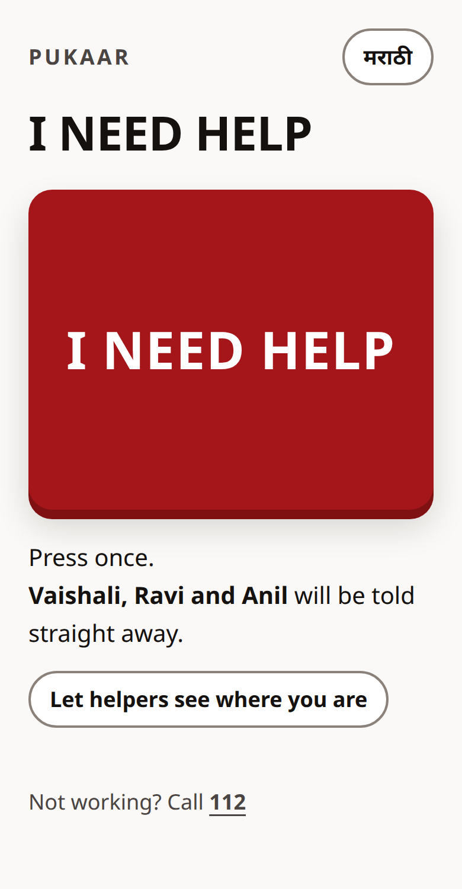
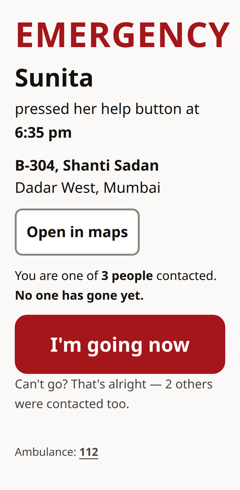
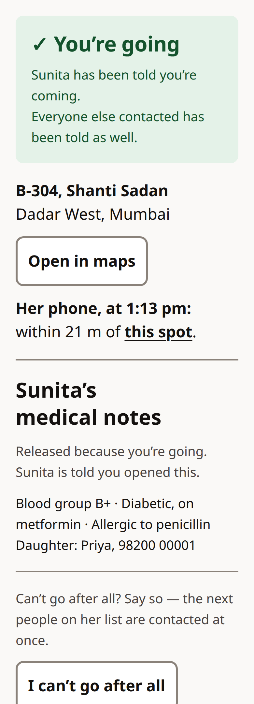
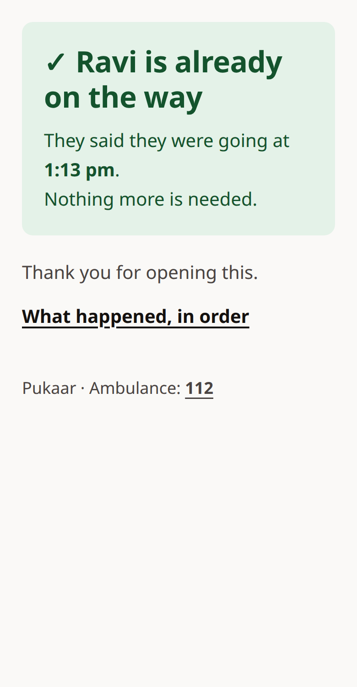
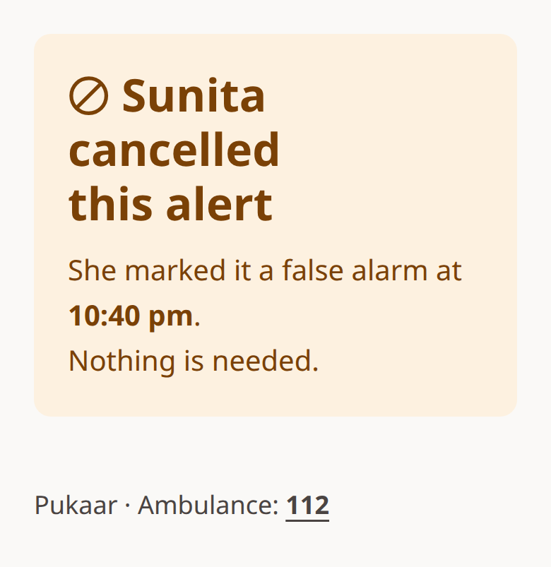
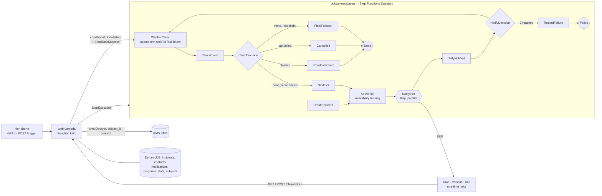

# Pukaar

**One press. The three people most likely to answer are paged in the same instant; the first to say "I'm going" wins; everyone else is told who is coming; if nobody answers in a minute the circle widens.** An older person living alone should not have to work through a phone list while she is on the floor.

- **The one design decision:** the escalation is a Step Functions state machine, not a loop in a server. A parallel `Map` pages a whole circle at once, a conditional DynamoDB write decides the race between answerers, and the machine *waits for a task token* — a claim or a cancel wakes it in about a second instead of at the next timer.
- **What an incident costs:** about **$0.0013 (₹0.12)** when the son answers from the first circle, **$0.0039 (₹0.34)** when nobody answers and it widens to everyone. Idle is a fraction of a cent per person per month plus one $1/month key; a thousand people with one incident each come to about $6/month. Numbers from [`cost.py`](cost.py), list prices, counted off real executions.
- **Live:** https://jseoe3z3uew46fyd6zbceyry6u0ebdgt.lambda-url.ap-south-1.on.aws/ — pressing it pages six test mailboxes, all mine.
- **Demo video:** *added at submission.*
- **Proof it works:** [`verify.sh`](verify.sh) runs eleven checks against the live stack, each asserting on rows and execution history, never on a status code. Last run 11/11. Every break during the build is in [`LEARNING-LOG.md`](LEARNING-LOG.md) with the commit that fixed it.

Built solo, in the open, during Bharat Builds Tour — First Commit, 17–20 September 2026, ap-south-1.

---

## The problem

An older person living alone falls, or feels something is wrong, and has a phone. What she does with it is call one number. If it does not answer she calls the next, and each try costs a minute she is not sure she has. The son is in a meeting; the neighbour across the hall is home but was never called; nobody knows that nobody is coming.

Ten conversations, not a study: neighbours in one building, in their late sixties to eighties, most of whom said they had the same problem. One woman said that the last time she needed someone urgently she called at least three or four people before one answered — she does not remember the exact number. Her son first, then relatives nearby; a nephew about two kilometres away came, in fifteen to twenty minutes, which she called lucky. Her nearest neighbours were out at work on weekdays; once, she called the building's watchman, and he helped. None of this is measured; it is what she said, and she agreed to be mentioned without her name.

Pukaar replaces the sequence with a fan-out. One press pages the three people most likely to answer *right now*, in parallel. The first to say "I'm going" wins, everyone else is told who is coming, and if nobody answers within a minute the circle widens. She can call it off herself with one more press, even after someone is on their way.

## What happens when she presses

1. **Her screen** (`GET /`) is one button. It already says who will be told — *"Vaishali, Ravi and Anil will be told straight away"* — read from the same ranking the machine will use. It installs on her home screen as *Pukaar* (`/manifest.webmanifest`, two PNG icons served by the same function), so the button is an icon, not an address to type. It speaks her language: one tap on the toggle (or `?lang=mr`) puts every word on her screen in Marathi — *मला मदत हवी आहे* — and the phone remembers. Only her page is translated; the people paged are younger, and their pages and emails stay English.
2. **The press** (`POST /trigger`) starts one execution of `pukaar-escalation`, named after the incident, so a retried request cannot start the same incident twice; the button disables itself on press.
3. **The circle is paged at once.** `SelectTier` ranks everyone on her list and takes the top three not yet reached; a parallel `Map` sends each of them an email with a one-time link. In the execution history the three sends carry the same timestamp (`13:22:59.690` on the first live run).
4. **The machine waits for a task token**, parked on the incident row. If nobody answers in `wait_s` seconds it wakes by timeout, checks the row, and widens to the next three. At the last circle everyone is paged, then a final *no one has reached her* email goes to the whole list.
5. **Someone taps "I'm going now."** One conditional `UpdateItem` — `status IN (OPEN, FALLBACK)` — decides the race; the loser's page says *"Ravi is already on the way"* by name, read from the row after the write. The winning write returns the parked token, `SendTaskSuccess` wakes the machine, and everyone reached is told who is coming. Measured: cancel → *Cancelled* in **1.0 s**, claim → everyone told in **2.8 s** including the emails.
6. **The winner's page opens her sealed medical notes** — blood group, medication, allergy, a daughter's number — decrypted from a KMS customer-managed key for that one person, and her screen says *"Ravi has your medical notes."*
7. **Her screen updates by itself** (`GET /status`, polled every 3 s): *✓ Ravi is coming*. A Cancel button stays on it; she may be fine after all.

<p align="center">
  
  
  
  
  
</p>

*Her button · the alert · you're going (with the notes) · already on the way · cancelled. Every text colour on these screens is at least 7:1 against its background, the AAA line; the button is 240 px tall, every other target at least 48 px.*

### Correctness properties, stated

| Property | How |
| --- | --- |
| A circle is paged in the same instant, not in sequence | `NotifyTier` is a `Map`, not a chain of tasks |
| Two people answering at once produce exactly one winner, and the loser learns who | one conditional write on the incident row; the page renders from the row after the write, never from what the request hoped |
| Re-running a send never pages twice | the notification row is written first with `attribute_not_exists`; a retry that finds it delivered sends nothing |
| A link that is prefetched by a mail scanner claims nothing | **GET never writes.** Claim links render on GET and claim on POST; the button is the claim |
| A circle that reached nobody fails loudly | one bad address is contained to its iteration; a whole circle with zero deliveries goes to `RecordFailure`, the execution fails, and a metric fires — no silent minute of waiting |
| A claim or a cancel is acted on now, not at the tier boundary | `WaitForClaim` is `dynamodb:updateItem.waitForTaskToken`; the same write that wins the race returns the token |
| She can cancel at any point, including after someone claimed | after a claim the machine has finished, so the web function asks the broadcast function for the false alarm directly |
| The medical notes are ciphertext at rest and open for one person | KMS CMK, `EncryptionContext={subject_id}`, decrypt permitted to the web role only and only with a context; every opening logged |

## Architecture



- **Compute:** seven Python 3.13 Lambdas on arm64, 128 MB, one zip. Six run inside the machine under role `pukaar-lambda` (DynamoDB, SES, one metric namespace — **no KMS**); `web` runs under `pukaar-web` (DynamoDB, start/wake the machine, invoke `broadcast`, `kms:Decrypt` — **no SES**).
- **Data:** five on-demand DynamoDB tables. `notifications` stores only the **SHA-256 of the link token** (GSI `token_hash-index`); the plaintext exists in the email alone. `subjects.record` is a Binary ciphertext.
- **Edge:** one Lambda Function URL, six routes, no API Gateway, no login (the button is hers; the links are one-time, per incident, per person).
- **Infra:** Terraform, AWS provider 6.x, log retention 7 days, everything in [`main.tf`](main.tf).

## Availability ranking — who is in the first circle

The circle is a *membership*, not an order. Inside a parallel `Map` order is invisible, so the only thing the ranking can change is **who is paged at all in the first minute**. [`lambdas/ranking.py`](lambdas/ranking.py):

```
score = 0.6 · answers + 0.2 · fast + 0.2 · near

answers  share of pages answered, smoothed by a prior worth two pages
         (one answered if usually home during the day, half if not);
         pages in the current hour bucket (e.g. 14#weekday) count twice
fast     1 / (1 + mean answer time in minutes); 0.5 unknown; 0 if paged and never answered
near     1 / (1 + metres / 100)
```

So a known answerer beats an unknown, an unknown beats a known non-answerer, and distance decides only between people the history cannot separate. Every page (`notify`) adds to `pages_sent` for that person and hour; every tap on a link (`web`) adds one response and its latency — once per page, win or lose, because a lost race still says they were reachable.

**What it changes, on the seeded circle** (`seed.sh`; the histories are seeded, the counters written since are real; scores as at any hour but the seeded 2 pm one, when those rows count twice):

| | Nearest three by distance | First circle by score |
| --- | --- | --- |
| paged at once | **Meena** (8 m, has never answered a 2 pm page), Vaishali (40 m), Anil (60 m) | **Vaishali** (5/5, 0.775), **Ravi** (son, 4 km, 4/4, 0.569), **Anil** (no history, usually home, 0.525) |
| a minute later | Ravi, Sunil, Prakash | Sunil (0.491), Prakash (0.257), **Meena** (0.223) |

`SelectTier`'s output and log line carry the full ranking with a *basis* per person (`"5/5 answered"`, `"no history; usually home"`, `"0/6 answered, 0/6 this hour"`), so the choice is inspectable in the execution history. Check 7 of `verify.sh` asserts the nearest non-answerer is out of the first circle and paged in the second, and the best answerer is in the first.

## The sealed record

Her medical notes are encrypted at seed time with `kms:Encrypt` under `alias/pukaar-record`, a customer-managed key, with `EncryptionContext={"subject_id": "sunita"}`, and stored as a DynamoDB Binary — 251 bytes, no envelope, nothing in the tables in the clear. Decrypting with another subject's id, or none, is `InvalidCiphertextException` (check 9). The only principal allowed `kms:Decrypt` is the web role, and only when the call carries a `subject_id` context (`Null` condition in IAM); `simulate-principal-policy` says `implicitDeny` for the paging role, and for the web role without a context.

The record renders on exactly one page: the claim page in its *You're going* state. Before the claim, on the loser's page, on a cancelled or finished alert, it is absent (checks 9 and 11). Every opening writes one log line — `{"event": "record_released", "incident_id": "3d1e4f4cac0a", "contact_id": "ravi", "subject_id": "sunita", "at": "2026-09-17T12:40:41+00:00"}` — and the opening that comes with the claim is written on her incident so her screen can say who has them. CloudTrail carries the matching `Decrypt` event, id `5d264b7a-3763-49ae-8daa-08f3e8f69bf4`, 18:10:41 IST, role `pukaar-web`, context `{subject_id: sunita}`.

## Cost

ap-south-1 list prices from the AWS Price List API on 17 Sep 2026, free tiers ignored; transitions, machine invocations and emails counted off real executions of this stack (`v-182122-claim`, `cost-182725`). [`cost.py`](cost.py) prints this table and [`tests/test_cost_numbers.py`](tests/test_cost_numbers.py) fails if the README drifts from it.

| Incident | Step Functions | Lambda | DynamoDB | SES | KMS | Total |
| --- | --- | --- | --- | --- | --- | --- |
| Ravi claims at the first circle (13 transitions, 6 emails) | $0.00037 | $0.00003 | $0.00002 | $0.00090 | $0.00001 | **$0.00133** (₹0.12) |
| Nobody claims: three circles, then the fallback (38 transitions, 18 emails) | $0.00108 | $0.00007 | $0.00006 | $0.00270 | $0.00000 | **$0.00391** (₹0.34) |

Idle, per subject per month: $0.00364. Fixed, whole system: one KMS key, $1.00/month.
A thousand people, one incident each a month: about $6/month (₹525).

Decisions made for cost: **Standard, not Express** workflows — a parked `waitForTaskToken` costs nothing per second, and the wait is the whole product; **a Function URL, not API Gateway** — six routes, no auth layer to pay for; **arm64** Lambdas at 128 MB; **DynamoDB on-demand** — near-zero traffic between incidents; **no VPC**, so no NAT Gateway; **log retention 7 days**; **email, not SMS** — SES is about ₹0.013 a message against ₹0.20+ for Indian SMS, and sender-ID SMS needs a registration this weekend does not have. The largest line in the whole bill is the $1 key.

## What I learned

One sentence separates the two lists: **the first list was practised before kickoff and is here for honesty; only the second was learned during the four days**, and each of its entries links the commit that fixed it and the log entry written within thirty minutes.

**Practised before kickoff, not claimed:** Step Functions `Map`, `Choice` and `Wait`; passing state between tasks with `ResultPath`; Terraform for Lambda + DynamoDB + IAM; SES production access on a verified domain; that a circle which reached nobody must be a failure of the machine, not a timed wait (found 10 Sep on the plan, before any code); that AWS-managed KMS keys cannot be called from your own code and that Python's standard library has no AES (read in the KMS developer guide on 12 Sep, so the record uses a customer-managed key and direct `Encrypt`/`Decrypt` with no envelope).

**Learned during the four days** — from [`LEARNING-LOG.md`](LEARNING-LOG.md):

1. **A public Function URL is not public with `authorization_type = NONE` alone.** Since October 2025 it also needs `lambda:InvokeFunction` conditioned on `lambda:InvokedViaFunctionUrl`; the URL resource's own `InvokeFunctionUrl` grant was already there and every request still got 403. The argument does not exist in the AWS provider 5.x, so the provider moved to 6.x. Fix [`fae8b5d`](https://github.com/aryangorde6/pukaar/commit/fae8b5d), entry 13:15.
2. **`git log --reverse --max-count=1` returns the newest commit**, because the limit is applied before the reversal — so the log's own test was green on an empty log and red on the first real entry. `git rev-list --max-parents=0` names the root commit. Fix [`e166ce0`](https://github.com/aryangorde6/pukaar/commit/e166ce0), entry 13:19.
3. **The wait was a timer, so "immediate" was a tier late.** A `Wait` + poll acted on a cancel 15.4 s after she pressed it on a 20 s test timer — up to a minute in production. `.waitForTaskToken` composes with a plain DynamoDB SDK integration: the *write that parks the token* is a conditional `updateItem`, `TimeoutSecondsPath` keeps the tier timeout as an input, and the two exits (`States.Timeout`, `DynamoDb.ConditionalCheckFailedException`) are caught into the same `CheckClaim`. A stale token raises `TaskTimedOut`, not `InvalidToken`. After: 1.0 s. Fix [`9a1cf95`](https://github.com/aryangorde6/pukaar/commit/9a1cf95), entry 13:52.
4. **One ignored page erased five answered ones.** The first ranking used this-hour evidence if any existed, else any-hour evidence: one unanswered test page at 17:56 turned a 5/5 answerer into "0/1 this hour" and two strangers to the history were paged before her — and `verify.sh` still passed, because check 7 never asked whether the best answerer was in the circle. Pooled counts with a two-page prior, this hour counted twice; check 7 now asks. Fix [`6eb8ad0`](https://github.com/aryangorde6/pukaar/commit/6eb8ad0), entry 18:00.
5. **The Cancel button on "Ravi is coming" did nothing.** Cancel accepted `OPEN` and `FALLBACK` only, and once someone has claimed the machine has already broadcast and finished, so there was no token to wake either. Cancel now accepts `CLAIMED` and the web function invokes `broadcast` for the false alarm itself; the web role gained that one `lambda:InvokeFunction`. Fix [`4ebb86b`](https://github.com/aryangorde6/pukaar/commit/4ebb86b), entry 18:18.
6. **Reseeding before the checks protected the checks, not the button.** The pages the eleven checks send are the last thing written, and the ranking learns from every page, so from the end of a run until the next reseed the live button ranked on test pages — it read *Vaishali, Anil and Ravi*, and twice that evening *Vaishali, Sunil and Ravi*, while this README quotes *Vaishali, Ravi and Anil*. `verify.sh` now reseeds after the checks as well as before; presses made by hand still need `./seed.sh` after them. Fix [`f6512d6`](https://github.com/aryangorde6/pukaar/commit/f6512d6), entry 23:10.

Also new to me this week, without a break to log: a KMS encryption context as the thing that binds a ciphertext to one person; the IAM `Null` condition on `kms:EncryptionContext:subject_id`; `aws iam simulate-principal-policy` as evidence you can paste; that CloudTrail's `Decrypt` events for a Lambda's own environment variables sit next to yours, with `aws:lambda:FunctionArn` as their context.

## What it does not do

- **No SMS or calls.** Email only, because SES works today and Indian sender-ID SMS needs a registration. An older person's helpers mostly have Gmail on their phones; this is a channel choice, not a claim that email is enough.
- **Dispatch, not delivery.** SES accepts the message; where Gmail files it is unobservable from this side and drifts. Every check here asserts on the send, the row and the message id.
- **The histories in the demo are seeded.** `seed.sh` writes the 2 pm records that make the ranking visible and, on re-run, deletes everything counted since; between runs the counters are real (a real claim at 5:57 pm added `responses 1, 46 000 ms` to Ravi's `17#weekday` row, until the next reseed). A low-stakes periodic test ping — "tap to confirm you'd be reachable" — would grow real history without waiting for emergencies; it is the stated next step, not built.
- **Consent, caps and removal for contacts are designed, not built.** Nothing can add a stranger's address: subjects and contacts enter through a script the operator runs. There is no self-serve form, precisely because an open form here is an open relay.
- **The unconscious case is not covered.** She has to press. A passive check-in backstop was cut first.
- **One subject.** The web function serves one person's button (`SUBJECT_ID`); many subjects is a routing change, not a design change.
- **The record opening is logged, not gated by a second factor.** Whoever holds a winning link sees the notes. The link is one-time, per incident, per person, hashed at rest, and dies with the incident.

## Prior art

Commercial systems converge on this shape — [Alerto](https://alertotech.com/), [HelpQR](https://helpqr.org/blog/sos-app-india) — and that convergence validates the approach; nothing here is claimed as novel. What is mine is an AWS-native implementation with *stated* correctness properties: no double page under retry, acknowledgement races resolved by one atomic write, the wait as a callback rather than a timer, a first circle chosen by who actually answers, and sealed data released only on a claim and logged when it is.

## Run it

```bash
terraform init && terraform apply          # AWS_PROFILE and region in variables.tf
./seed.sh                                  # Sunita, her six contacts, their histories, her sealed notes
./verify.sh                                # eleven live checks; reseeds before and after
.venv/bin/pytest -q                        # ranking, the learning log, the cost numbers
```

`variables.tf` holds the sender identity (SES production access on a verified domain is assumed), `wait_s` (60 in production; every test above passes 3–25) and `max_tier`.

---

AI tools used in this build: Claude Code (Anthropic), as a coding assistant.
